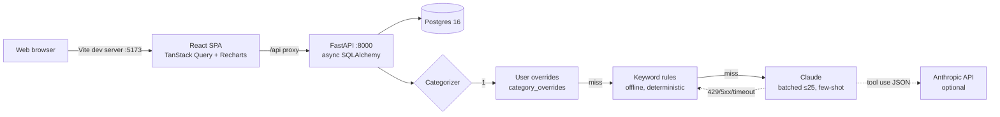

# LedgerLens

[](https://github.com/AbhiramCommits/LedgerLens/actions/workflows/ci.yml)

**LedgerLens** turns messy bank CSV exports into a clean, categorized view of
your money. Upload a Chase or Amex statement (or any bank, really — the parser
figures out columns, date formats, and amount quirks on its own), and every
transaction gets categorized in three tiers: your past corrections win
automatically, a deterministic rule engine catches the obvious ones, and
Claude handles the long tail — batched, few-shot-primed with your corrections.
When you fix a category in the table, that correction is remembered and
applied to future imports, so the app measurably gets smarter the more you use
it. All of it runs happily **without** an Anthropic API key via the rule tier.

## Architecture



## Quickstart

Prerequisites: Docker with Compose.

```sh
cp .env.example .env
make up        # builds + starts db, api, web
make migrate   # applies Alembic migrations
```

Open http://localhost:5173 (API on http://localhost:18000, docs at `/docs`).

**Demo in under two minutes:** `make seed` registers `demo@ledgerlens.dev` /
`demo-password` and loads ~400 synthetic Chase + Amex transactions from
[`sample_data/`](sample_data/) with a realistic spread over the last six months
— rules categorize the bulk of them instantly, and the rest fall back to
`other` until you either correct them or add an `ANTHROPIC_API_KEY`.

## API

All routes except `GET /health` require a bearer token from register/login;
every query is scoped to the authenticated user — cross-user access returns
404, never data.

| Method | Path | Description |
| ------ | ---- | ----------- |
| POST | `/api/auth/register`, `/api/auth/login` | JWT auth (bcrypt hashes) |
| GET/POST | `/api/accounts` | List / create accounts |
| POST | `/api/imports` | Multipart CSV upload → `{batch_id, inserted, skipped, errors}` |
| GET | `/api/imports/{batch_id}` | Import batch status |
| GET | `/api/transactions` | Paginated, sortable, filterable list (`category`, `max_confidence`, …) |
| POST | `/api/transactions/categorize` | Run the 3-tier pipeline over uncategorized rows |
| PATCH | `/api/transactions/{id}` | Set a category manually (records an override) |
| GET | `/api/analytics/by-category?month=YYYY-MM` | Totals + counts per category |
| GET | `/api/analytics/by-source?month=YYYY-MM` | Share of LLM vs rule vs user categories |
| GET | `/api/analytics/monthly-trend?months=6` | 6-month spend/income trend |

## Frontend

React 18 + TypeScript + Vite + TanStack Query + Recharts + Tailwind. Pages:
login/register (field-level validation), dashboard (month picker, category
donut, 6-month trend, stat tiles), transactions (sortable/filterable table,
inline category editing with optimistic updates + rollback), and CSV import
(drag-and-drop with progress, per-row error report, one-click categorize).

The API client is generated from the FastAPI OpenAPI schema — no hand-written
response types. After changing the backend, run `make gen-api` (or
`OPENAPI_URL=http://localhost:18000 npm run gen-api` in `frontend/`) and commit
the regenerated `frontend/src/api/schema.d.ts`.

## Runs without an API key

`ANTHROPIC_API_KEY` only powers the third tier. With no key configured the app
still works end to end: overrides and rules categorize what they can, the rest
lands in `other` (confidence 0) for review, and the reason is logged and
surfaced in the categorize response. Set the key (and optionally
`ANTHROPIC_MODEL`, default `claude-sonnet-4-5`) in `.env` to enable it.

## Screenshots

<!--
TODO: add screenshots before the demo.
- Login/register
- Dashboard with month picker, donut, trend, and source share
- Transactions table with inline category editing
- Import flow with progress bar and result summary
-->

## Design decisions

**Why is the categorizer tiered?** Cost, latency, and control. Overrides are
instant and always right (they're the user's own corrections), rules are free,
deterministic, and fully offline, and the LLM is reserved for merchants
neither tier recognizes. Tiers also make behavior composable: each tier is
independently testable, and the pipeline degrades gracefully when the network
disappears.

**How is confidence used?** Every assignment carries a source (`user`, `rule`,
`llm`) and a confidence score — 1.0 for user corrections, 0.9 for rules, the
model's own estimate for LLM, 0.0 for the fallback `other`. The transactions
page exposes a confidence filter so low-confidence rows surface first for
review.

**How does the correction feedback loop work?** PATCHing a transaction stores
a `category_overrides` row keyed on the cleaned merchant. On the next run the
override tier short-circuits before any network call, and the user's 10 most
recent overrides are also injected as few-shot examples into the LLM prompt —
so corrections change both the deterministic and the learned behavior.

## Development

```sh
make test    # backend pytest against real Postgres (coverage >= 80% enforced)
             # + frontend vitest
make lint    # ruff + mypy (strict) + eslint + prettier
make seed    # load sample data as the demo user
make gen-api # regenerate the typed API client
```

See [CONTRIBUTING.md](CONTRIBUTING.md) for the workflow, and
[.github/workflows/ci.yml](.github/workflows/ci.yml) for the CI pipeline
(backend tests run against a dockerized Postgres, never mocks).
